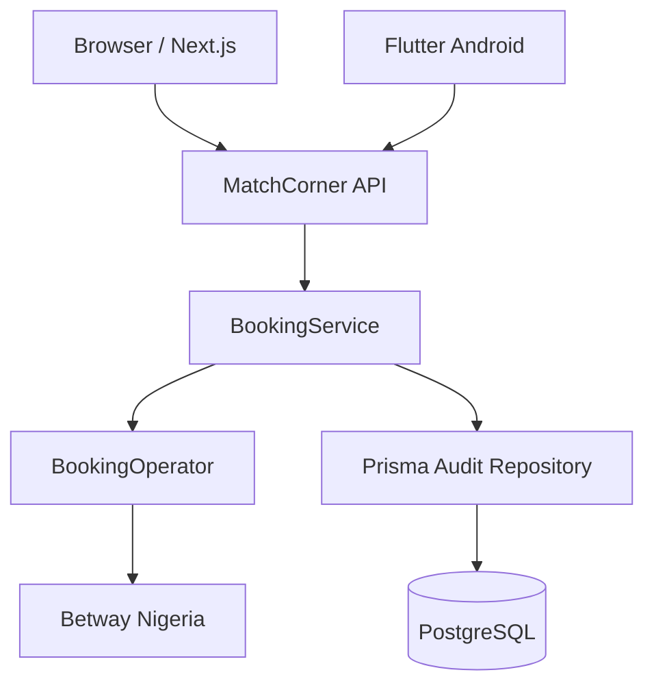
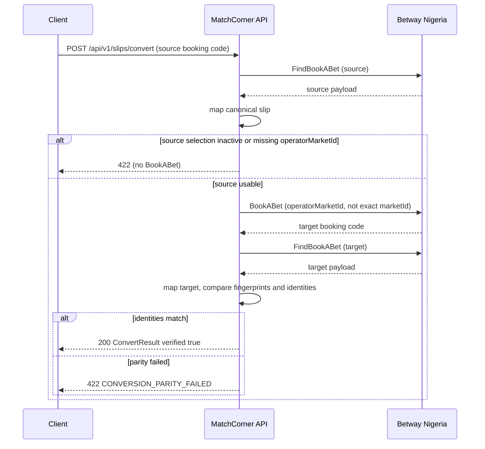

# Architecture

MatchCorner is a small monorepo: a Node.js API, a Next.js web workspace, a Flutter Decode viewer, and a shared canonical contract package. Web and Flutter never call Betway.

Operator reconnaissance notes (FindBookABet / BookABet) live in [betway-integration.md](betway-integration.md). Local and Railway operations live in [runbook.md](runbook.md).

## System architecture



- **Browser** and **Flutter** call `POST /api/v1/slips/decode` (web also calls encode and convert).
- **BookingService** orchestrates decode/encode/convert, fingerprints, and audit writes.
- **BookingOperator** is the only module allowed to speak Betway. The current implementation is Betway Nigeria (`FindBookABet` / `BookABet`).
- **Prisma Audit Repository** persists canonical `SlipSnapshot` and `ConversionRun` rows. It never accepts raw operator payloads.

## Monorepo structure

```text
apps/api                 Express + TypeScript API, Prisma, Betway adapter
apps/web                 Next.js Decode / Encode / Convert workspace
apps/mobile              Flutter Decode viewer (Android APK; same Dart code can target iOS)
packages/contracts       Canonical Betslip types, fingerprint, parity
docs                     Architecture, runbook, investigation, submission evidence
.github/workflows        Node + Flutter quality gates (ci.yml)
```

`@matchcorner/contracts` is a buildable ESM workspace package (`dist/`). Railway and CI compile it **before** the API or web production build so Node never executes TypeScript at runtime.

## Domain model

Application code depends on `@matchcorner/contracts` only. Operator-specific JSON is mapped at the adapter boundary.

**Betslip** is operator-neutral: `operator`, `bookingCode`, `betType` (`single` | `multi`), `isBuildABet`, and `selections`.

**Selection** carries display data (names, odds, start time, `active`) plus three identity fields and one write-only market field:

| Field | Role |
| --- | --- |
| `marketId` | Canonical **exact** Betway market identity, including the line when Betway encodes one. Taken from `originalMarket.marketId` when present, otherwise the selection `marketId`. Two handicap lines are two markets. Used for fingerprints and parity. |
| `operatorMarketId` | Betway **parent/display** market ID (`market.marketId`). Required on Encode / BookABet. |
| `selectionId` | Betway `outcomeId`. |
| `eventId` | Event identifier as a string (Betway sends a number; we normalize). |

These market fields **must stay separate**. Fingerprints need the exact line (`originalMarket`) so a −1.5 and −3.5 handicap are distinct bets. BookABet rejects that exact id and expects the parent market id instead. Sending `marketId` on write, or using `operatorMarketId` as identity, would either fail encode or treat different lines as the same selection.

`DecodedSlip` is `{ slip, fingerprint }`. Successful **Convert** is `{ sourceCode, targetCode, verified: true, fingerprints, counts, slip }` — a generated code that failed parity is an error, not `verified: false` in the success body.

## Conversion sequence



A `BookABet` code is only returned as success after the target Decode matches the source on stable identities. On parity failure the API still records the conversion run (`verified: false`) and then throws; the client must not treat that target code as a completed conversion.

Decode and Convert persist canonical snapshots (`decode`, `convert-source`, `convert-target`). Encode does not persist a slip (there is no canonical slip until a later Decode).

## Fingerprint

```text
identity      = eventId + ":" + marketId + ":" + selectionId
payload       = identities sorted, joined with "|"
fingerprint   = SHA-256 hex digest of payload
```

Odds are excluded because they can legitimately move between the source Decode and the target re-Decode while the bet remains the same selection. Names, start times, `active`, and `operatorMarketId` are excluded for the same reason: they are display, availability, or write-mapping data, not identity.

Order is ignored by sorting identities before the hash. Duplicate identities still affect the fingerprint (the hash uses the sorted **list**, while missing/extra lists in a parity failure are derived from identity **sets** so the error can name which selections drifted).

## Persistence

| Model | What it stores |
| --- | --- |
| `SlipSnapshot` | Operator, booking code, fingerprint, bet type, selection count, **canonical slip JSON**, capture type, timestamp |
| `ConversionRun` | Source/target codes, fingerprints, `verified`, selection counts, missing/extra identities |

Explicitly **not** stored:

- raw Betway HTTP responses
- `accountId`
- cookies, `Authorization`, or other session material

`toCanonicalJson` refuse-lists those key names so a mistaken raw object cannot be written. Prisma schema and mapping tests live under `apps/api`.

## Security / privacy

- Betway calls are server-side only (timeout-bounded, errors normalized).
- Browser and mobile clients receive canonical JSON and structured `AppError` codes, not operator cookies or session headers.
- Zod schemas for Betway payloads allowlist consumed fields and do not model `accountId`.
- Audit writes are canonical snapshots only.
- Operator and database configuration is environment-based. `.env` is gitignored.
- Automated tests use sanitized fixtures (including an obvious placeholder `accountId` used only to prove it never reaches the canonical slip).
- No raw production Betway captures are committed.

This is boundary hygiene for an assessment integration, not a claim of a hardened multi-tenant security product. There is no end-user authentication in this repository.
