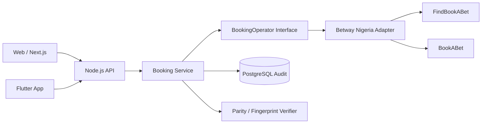

# MatchCorner Technical Assessment — Betway Nigeria Booking-Code Integration

**Progress documentation — 18 August 2026**  
**Status:** Operator integration discovery complete; application implementation in progress.

## Current milestone

Decode, Encode and Convert have been validated against Betway Nigeria. A newly generated booking code was decoded with full selection parity and loaded successfully in Betway's own UI.

**Verified generated code:** `BW69DC9F6B`

## Scope

- Decode: Betway booking code → normalized betslip.
- Encode: selections → new Betway booking code.
- Convert: source code → decode → recreate selections → new code → re-decode → parity check.
- Verify generated codes through Betway itself.
- Preserve a reviewable workflow without committing cookies, authorization data, account IDs or other private browser/session material.

## Investigation timeline

1. Observed public Betway booking-code and metadata requests.
2. Captured `POST /Betting/FindBookABet` and its response.
3. Confirmed the decode response contains event, market, `originalMarket`, outcome and price data.
4. Reviewed Betway's publicly delivered frontend JavaScript.
5. Located the `POST /Betting/BookABet` mutation used to create a booking code.
6. Called the endpoint with a sanitized request and received a real code.
7. First test (`BW69D25E9D`) exposed an edge case: one selection became unavailable, so the target slip had 3/4 parity.
8. Clean retest with four stable selections generated `BW69DC9F6B`.
9. Re-decoding `BW69DC9F6B` returned 4/4 matching selections.
10. Loading the same code in Betway's own UI restored all four selections.

## Operator contracts

### Decode

```http
POST https://www.betway.com.ng/appsynapse/bet-api-sr02/v2/Betting/FindBookABet
Content-Type: application/json
x-brand-id: f8a8d16a-d619-4b49-aa8c-f21211403c92
```

```json
{
  "countryCode": "NG",
  "bookingCode": "BW...",
  "cultureCode": "en-US"
}
```

### Encode

```http
POST /Betting/BookABet
```

```json
{
  "cultureCode": "en-US",
  "countryCode": "NG",
  "isSingleBet": false,
  "outcomes": [
    {
      "outcomeId": "...",
      "eventId": 12345678,
      "marketId": "...",
      "payment": 1,
      "value": 0,
      "selected": true
    }
  ]
}
```

Success:

```json
{ "bookingCode": "BW..." }
```

## Clean conversion proof

| Event | Selection | Event ID | Exact market | Outcome ID |
|---|---|---:|---|---|
| Connecticut Sun vs. Los Angeles Sparks | Los Angeles Sparks (-1.5) | 68096464 | `68096464223hcp=1.5~` | `68096464223hcp=1.5~1715` |
| Toronto Tempo vs. Indiana Fever | Indiana Fever (-10.5) | 68096586 | `68096586223hcp=10.5~` | `68096586223hcp=10.5~1715` |
| Chicago Sky vs. New York Liberty | New York Liberty (-4.5) | 68096120 | `68096120223hcp=4.5~` | `68096120223hcp=4.5~1715` |
| Las Vegas Aces vs. Atlanta Dream | Las Vegas Aces (-3.5) | 68096232 | `68096232223hcp=-3.5~` | `68096232223hcp=-3.5~1714` |

**Fingerprint:** `94c3c1d45329763971d28d59ca4dc2e3194c132ada692a639fb907fad395b56c`

### Parity rule

Use stable selection identity, not odds:

```text
eventId + ":" + originalMarket.marketId + ":" + outcomeId
```

Sort identities and SHA-256 the joined value for a slip fingerprint. Odds are excluded because they can move while the bet selection remains semantically the same.

## Convert algorithm

```text
source booking code
        |
        v
FindBookABet
        |
        v
canonical selections
        |
        v
BookABet
        |
        v
new booking code
        |
        v
FindBookABet(new code)
        |
        v
fingerprint comparison
```

A successful `BookABet` response alone is not sufficient. The generated code must be decoded again and verified.

## Security / privacy

- Never commit copied browser cookies, authorization/session headers or analytics identifiers.
- Do not commit raw source responses containing a real account identifier.
- Use sanitized fixtures.
- Keep the Betway integration server-side.
- Use environment variables for operator configuration.
- Apply timeouts and normalize upstream errors.

## Recommended Git commit boundaries

```text
docs: capture Betway booking-code reconnaissance
chore: bootstrap full-stack monorepo
feat(core): define canonical betslip contract
feat(api): decode Betway booking codes
docs: verify Betway booking-code creation contract
feat(api): encode selections into Betway booking codes
feat(api): convert slips with parity verification
feat(db): persist slip snapshots and conversion audits
feat(web): add decode encode convert workspace
feat(mobile): add Flutter betslip viewer
test: add booking-code contract and parity coverage
ci: add quality gates and production deployment config
docs: add architecture runbook and submission evidence
```

Only create each commit after the corresponding work is actually complete.

## Architecture



## Remaining work

- Implement the discovered contracts in the backend adapter.
- Implement Convert with mandatory parity verification.
- Add validation, timeout/error normalization and automated tests.
- Persist sanitized audit records in PostgreSQL.
- Build web Decode / Encode / Convert UI.
- Build Flutter slip viewer and APK.
- Deploy and validate production URLs.
- Complete final architecture/runbook documentation and 5-minute walkthrough.

## Current evidence checklist

- [x] Generated Betway code: `BW69DC9F6B`
- [x] API re-decode: 4/4 selections
- [x] Stable identity parity
- [x] Betway UI verification
- [ ] GitHub repository finalized
- [ ] Live web URL
- [ ] Flutter APK/distribution
- [ ] Final architecture/runbook
- [ ] 5-minute screen recording
